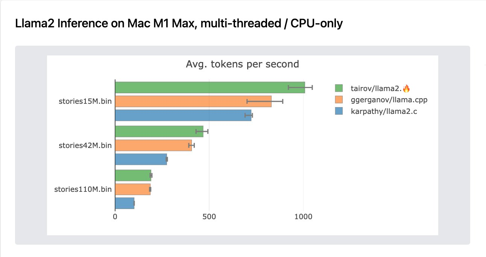

## llama2.🔥

<p align="center">
  
</p>

Have you ever wanted to inference a baby Llama 2 model in pure Mojo? No? Well, now you can!

With the release of [Mojo](https://www.modular.com/blog/mojo-its-finally-here), I was inspired to take my Python port
of [llama2.py](https://github.com/tairov/llama2.py) and transition it to Mojo. The result? A version that leverages
Mojo's SIMD & vectorization primitives, boosting the Python performance by nearly 250x. 
Impressively, after few native improvements the Mojo version outperforms the original `llama2.c` by 30% in multi-threaded inference. As well as it outperforms `llama.cpp` on baby-llama inference on CPU by 20%.
This showcases the potential of hardware-level optimizations through Mojo's advanced features.

## supported models

At the moment, the following models were successfully executed via `llama2.mojo`:

| Models                       |
|------------------------------|
| stories 260K, 15M, 42M, 110M |
| Tinyllama-1.1B-Chat-v0.2     |


## prerequisites

Make sure you have installed
and [configured mojo on your environment](https://docs.modular.com/mojo/manual/get-started/index.html)

Or you can use [mojo playground](https://playground.modular.com/) to run this model.


## feel the 🔥 magic

First, navigate to the folder when you keep your projects and clone this repository to this folder:

```bash
git clone https://github.com/emd1tey/mojo-example-app.git 
```

Then, open the repository folder:

```bash
cd mojo-example-app/llama
```

Now, let's download the model

```bash
wget https://huggingface.co/karpathy/tinyllamas/resolve/main/stories15M.bin
```

Then, just run the Mojo

```bash
cd .. && mojo llama2.mojo llama/stories42M.bin -s 99 -n 256 -t 0.5 -i "Llama is an animal"
```

**example output**

```
checkpoint: llama/stories15M.bin temperature:  0.0 steps:  256 seed:  9007199254740992 
prompt:  test
num parallel workers: 4  SIMD width: 16
Total bytes read: 60816028 Estimated checkpoint size:  57 MB
n layers: 6 | vocab size: 32000 

test was a very excited to go to the park. He was so excited to go and play with his friends. He ran to the park and saw a big slide. He wanted to go down it so he ran to it.
When he got to the slide, he saw a little girl. She was so excited to go down the slide. She said, "Hi! I'm so excited to go down the slide!"
The little girl said, "I'm so excited to go down the slide too! Let's go together!"
So they both went up the slide together. They went down the slide and laughed and had so much fun. They were so excited to go down the slide together.
When they got to the bottom, they both said, "That was so much fun! Let's do it again!"
The little girl said, "Yes! Let's go again!"
So they went back up the slide and went down the slide again and again. They had so much fun that day!

achieved tok/s:  56.903991370010786
```

## running via Docker

```bash
docker compose up -d
```

With Gradio UI:

```bash
# uncomment the last line in Dockerfile CMD ["python", "gradio_app.py"]
docker compose up -d
``` 


